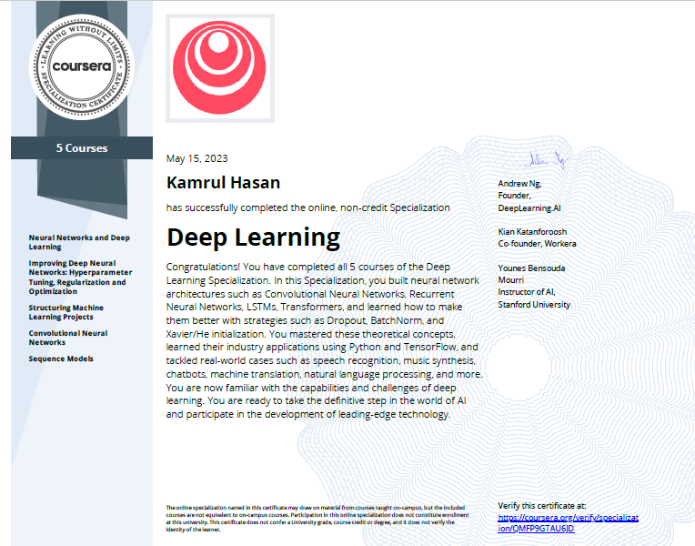

# Deep Learning Specialization on Coursera (offered by deeplearning.ai)

- Organization: [deeplearning.ai](https://www.deeplearning.ai)
- Coursera: [Deep Learning Specialization](https://www.coursera.org/specializations/deep-learning)
- Instructor: [Andrew Ng](http://www.andrewng.org/)

## Introduction
This repository contains all my programming assignments and quiz questions and their solutions for this specialization course. All the source code and data are taken from [Deep Learning Specialization on Coursera](https://www.coursera.org/specializations/deep-learning). The solutions posted here are only for reference purposes.

## About the Course:
As a student of CSE and a self-taught learner, I have completed many CS-related online courses from Coursera, Freecodecamp, Bohubrihi, and Datacamp. Sometimes it's very hard to find exact solutions and have to invest time in debugging and further reading. For completing this course I also stuck several times completing programming assignments and solving quiz questions. And I tried several times to pass these tasks/exams. When I was stuck for a long time I also took help from google/youtube/course_materials. This specialization course has 5 courses in total. And it will take several months to complete the course. I think this course gives me a proper path to becoming a deep learning engineer. When you are stuck, try to solve the problems by yourself and then take help from several sources to learn properly. I think this is the best deep learning course for those who want to learn deep learning from scratch. Thanks a lot to Andrew Ng and deepleaning.ai them.

## Course Certificate

## Programming Assignments

### Course 1: Neural Networks and Deep Learning
  - [Week 1 - First week doesn't have any Programming Assignment]
  - [Week 2 - Programming Assignment(1) - Logistic Regression with a Neural Network mindset](https://github.com/kamrul-brur/Deep-Learning-Specialization-Coursera-/blob/master/C1_W2_Logistic_Regression_with_a_Neural_Network_mindset_Cat_vs_NonCat.ipynb)
  - [Week 3 - Programming Assignment(1) - Planar data classification with one hidden layer](https://github.com/kamrul-brur/Deep-Learning-Specialization-Coursera-/blob/master/C1_W3_Planar_data_classification_with_one_hidden_layer.ipynb)
  - [Week 4 - Programming Assignment(1) - Building your Deep Neural Network: Step by Step](https://github.com/kamrul-brur/Deep-Learning-Specialization-Coursera-/blob/master/C1_W4_Building_your_Deep_Neural_Network_Step_by_Step.ipynb)
  - [Week 4 - Programming Assignment(2) - Deep Neural Network for Image Classification: Application](https://github.com/kamrul-brur/Deep-Learning-Specialization-Coursera-/blob/master/C1_W4_Deep_Neural_Network_Application.ipynb)

### Course 2: Improving Deep Neural Networks: Hyperparameter tuning, Regularization and Optimization

  - [Week 1 - Programming Assignment(1) - Initialization](https://github.com/kamrul-brur/Deep-Learning-Specialization-Coursera-/blob/master/C2_W1_Initialization.ipynb)
  - [Week 1 - Programming Assignment(2) - Regularization](https://github.com/kamrul-brur/Deep-Learning-Specialization-Coursera-/blob/master/C2_W1_Regularization.ipynb)
  - [Week 1 - Programming Assignment(3) - Gradient Checking](https://github.com/kamrul-brur/Deep-Learning-Specialization-Coursera-/blob/master/C2_W1_Gradient_Checking.ipynb)
  - [Week 2 - Programming Assignment(1) - Optimization Methods](https://github.com/kamrul-brur/Deep-Learning-Specialization-Coursera-/blob/master/C2_W2_Optimization_methods.ipynb)
  - [Week 3 - Programming Assignment(1) - TensorFlow Tutorial](https://github.com/kamrul-brur/Deep-Learning-Specialization-Coursera-/blob/master/C2_W3_Tensorflow_introduction.ipynb)

### Course 3: Structuring Machine Learning Projects

  - This course doesn't have any programming assignments.
  
### Course 4: Convolutional Neural Networks

  - [Week 1 - Programming Assignment(1) - Convolutional Model, Step by Step](https://github.com/kamrul-brur/Deep-Learning-Specialization-Coursera-/blob/master/C4_W1_Convolution_model_Step_by_Step_v1.ipynb)
  - [Week 1 - Programming Assignment(2) - Convolution Model Application](https://github.com/kamrul-brur/Deep-Learning-Specialization-Coursera-/blob/master/C4_W1_Convolution_model_Application.ipynb)
  - [Week 2 - Programming Assignment(1) - Residual Networks](https://github.com/kamrul-brur/Deep-Learning-Specialization-Coursera-/blob/master/C4_W2_Residual_Networks.ipynb)
  - [Week 2 - Programming Assignment(2) - Transfer Learning with MobileNet](https://github.com/kamrul-brur/Deep-Learning-Specialization-Coursera-/blob/master/C4_W2_Transfer_learning_with_MobileNet_v1.ipynb)
  - [Week 3 - Programming Assignment(1) - Car detection with YOLO](https://github.com/kamrul-brur/Deep-Learning-Specialization-Coursera-/blob/master/C4_W3_Autonomous_driving_application_Car_detection.ipynb)
  - [Week 3 - Programming Assignment(2) - Image Segmentation with U-Net](https://github.com/kamrul-brur/Deep-Learning-Specialization-Coursera-/blob/master/C4_W3_Image_segmentation_Unet_v2.ipynb)
  - [Week 4 - Programming Assignment(1) - Face Recognition](https://github.com/kamrul-brur/Deep-Learning-Specialization-Coursera-/blob/master/C4_W4_Face_Recognition.ipynb)
  - [Week 4 - Programming Assignment(2) - Art Generation with Neural Style Transfer](https://github.com/kamrul-brur/Deep-Learning-Specialization-Coursera-/blob/master/C4_W4_Art_Generation_with_Neural_Style_Transfer.ipynb) 
  
### Course 5: Sequence Models

  - [Week 1 - Programming Assignment(1) - Building a Recurrent Neural Network - Step by Step](https://github.com/kamrul-brur/Deep-Learning-Specialization-Coursera-/blob/master/C5_W1_Building_a_Recurrent_Neural_Network_Step_by_Step.ipynb)
  - [Week 1 - Programming Assignment(2) - Dinosaur Island-Character-Level Language Modeling](https://github.com/kamrul-brur/Deep-Learning-Specialization-Coursera-/blob/master/C5_W1_Dinosaurus_Island_Character_level_language_model.ipynb)
  - [Week 1 - Programming Assignment(3) - Jazz improvisation with LSTM](https://github.com/kamrul-brur/Deep-Learning-Specialization-Coursera-/blob/master/C5_W1_Improvise_a_Jazz_Solo_with_an_LSTM_Network_v4.ipynb)
  - [Week 2 - Programming Assignment(1) - Operations on Word Vectors - Debiasing](https://github.com/kamrul-brur/Deep-Learning-Specialization-Coursera-/blob/master/C5_W2_Operations_on_word_vectors_v2a.ipynb) 
  - [Week 2 - Programming Assignment(2) - Emojify](https://github.com/kamrul-brur/Deep-Learning-Specialization-Coursera-/blob/master/C5_W2_Emoji_v3a.ipynb)
  - [Week 3 - Programming Assignment(1) - Neural Machine Translation](https://github.com/kamrul-brur/Deep-Learning-Specialization-Coursera-/blob/master/C5_W3_Neural_machine_translation_with_attention_v4a.ipynb) 
  - [Week 3 - Programming Assignment(2) - Trigger Word Detection](https://github.com/kamrul-brur/Deep-Learning-Specialization-Coursera-/blob/master/C5_W3_Trigger_word_detection_v2a.ipynb)
  - [Week 4 - Programming Assignment(1) -  Transformers Architecture with TensorFlow](https://github.com/kamrul-brur/Deep-Learning-Specialization-Coursera-/blob/master/C5_W4_A1_Transformer_Subclass_v1.ipynb)
  

## Quiz Solutions

### Course 1: Neural Networks and Deep Learning

  - Week 1 Quiz - [Introduction to deep learning](https://github.com/kamrul-brur/Deep-Learning-Specialization-Coursera-/blob/master/quiz_solutions/C1_W1_Introduction%20to%20Deep%20Learning.pdf)
  - Week 2 Quiz - [Neural Network Basics](https://github.com/kamrul-brur/Deep-Learning-Specialization-Coursera-/blob/master/quiz_solutions/C1_W2_Neural%20Network%20Basics.pdf)
  - Week 3 Quiz - [Shallow Neural Networks](https://github.com/kamrul-brur/Deep-Learning-Specialization-Coursera-/blob/master/quiz_solutions/C1_W3_Shallow%20Neural%20Networks.pdf)
  - Week 4 Quiz - [Key concepts on Deep Neural Networks](https://github.com/kamrul-brur/Deep-Learning-Specialization-Coursera-/blob/master/quiz_solutions/C1_W4_Key%20Concepts%20on%20Deep%20Neural%20Networks.pdf)

### Course 2: Improving Deep Neural Networks: Hyperparameter tuning, Regularization and Optimization

  - Week 1 Quiz - [Practical aspects of deep learning](https://github.com/kamrul-brur/Deep-Learning-Specialization-Coursera-/blob/master/quiz_solutions/C2_W1_Practical%20aspects%20of%20Deep%20Learning.pdf)
  - Week 2 Quiz - [Optimization algorithms](https://github.com/kamrul-brur/Deep-Learning-Specialization-Coursera-/blob/master/quiz_solutions/C2_W2_Optimization%20Algorithms.pdf)
  - Week 3 Quiz - [Hyperparameter tuning, Batch Normalization, Programming Frameworks](https://github.com/kamrul-brur/Deep-Learning-Specialization-Coursera-/blob/master/quiz_solutions/C2_W3_Hyperparameter%20tuning%2C%20Batch%20Normalization%2C%20Programming%20Frameworks.pdf)
  
### Course 3: Structuring Machine Learning Projects

  - Week 1 Quiz - [Bird recognition in the city of Peacetopia (case study)](https://github.com/kamrul-brur/Deep-Learning-Specialization-Coursera-/blob/master/quiz_solutions/C3_W1_Bird%20Recognition%20in%20the%20City%20of%20Peacetopia%20(Case%20Study).pdf)
  - Week 2 Quiz - [Autonomous driving (case study)](https://github.com/kamrul-brur/Deep-Learning-Specialization-Coursera-/blob/master/quiz_solutions/C3_W2_Autonomous%20Driving%20(Case%20Study).pdf)

### Course 4: Convolutional Neural Networks

  - Week 1 Quiz - [The basics of ConvNets](https://github.com/kamrul-brur/Deep-Learning-Specialization-Coursera-/blob/master/quiz_solutions/C4_W1_The%20Basics%20of%20ConvNets.pdf)
  - Week 2 Quiz - [Deep convolutional models](https://github.com/kamrul-brur/Deep-Learning-Specialization-Coursera-/blob/master/quiz_solutions/C4_W2_Deep%20Convolutional%20Models.pdf)
  - Week 3 Quiz - [Detection algorithms](https://github.com/kamrul-brur/Deep-Learning-Specialization-Coursera-/blob/master/quiz_solutions/C4_W3_Detection%20Algorithms.pdf)
  - Week 4 Quiz - [Special applications: Face recognition & Neural style transfer](https://github.com/kamrul-brur/Deep-Learning-Specialization-Coursera-/blob/master/quiz_solutions/C4_W4_Special%20Applications%20Face%20Recognition%20%26%20Neural%20Style%20Transfer.pdf)

### Course 5: Sequence Models

  - Week 1 Quiz - [Recurrent Neural Networks](https://github.com/kamrul-brur/Deep-Learning-Specialization-Coursera-/blob/master/quiz_solutions/C5_W1_Recurrent%20Neural%20Networks.pdf)
  - Week 2 Quiz - [Natural Language Processing & Word Embeddings](https://github.com/kamrul-brur/Deep-Learning-Specialization-Coursera-/blob/master/quiz_solutions/C5_W2_Natural%20Language%20Processing%20%26%20Word%20Embeddings.pdf)
  - Week 3 Quiz - [Sequence models & Attention mechanism](https://github.com/kamrul-brur/Deep-Learning-Specialization-Coursera-/blob/master/quiz_solutions/C5_W3_Sequence%20Models%20%26%20Attention%20Mechanism.pdf)
  - Week 4 Quiz - [Transformers](https://github.com/kamrul-brur/Deep-Learning-Specialization-Coursera-/blob/master/quiz_solutions/C5_W4_Transformers.pdf)
